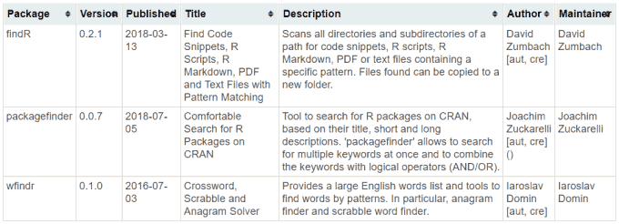
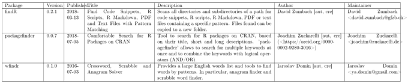
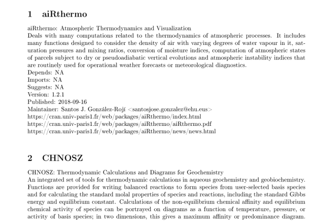
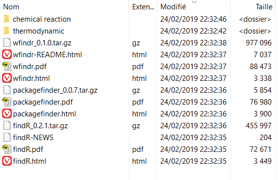
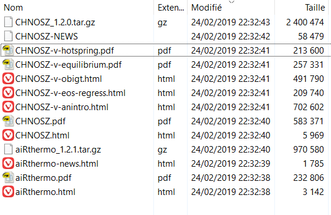
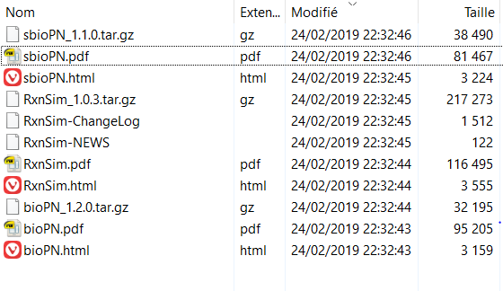

## Introduction

**RWsearch** stands for « Search in R packages, task views, CRAN and in the Web ». 

This vignette introduces the following features cited in the README file:

.5. **Display the results as a list or as a table** in the console or in the browser and save them as txt, md, html, tex or pdf files.

.6. In one instruction, **download in one directory the whole documentation** and the tar.gz files related to one or several packages. This is the perfect tool to read the documentation off-line and study the source code of a package.


## (Down)Load _crandb_ and extract packages

In this vignette, **_crandb_** must be loaded in *.GlobalEnv*. This can be done either by downloading a fresh version of _crandb_ or by loading a file. Read Vignette 1 and the details about **`crandb_down()`**. Here, we use the small file of 94 packages saved in _RWsearch/data_.

```r
crandb_down()
```
or
```r
crandb_load(system.file("data", "zcrandb.rda", package = "RWsearch"))
# $newfile
# crandb loaded. 94 packages listed between 2016-02-11 and 2024-09-20"

vec <- s_crandb(find, select = "P") ; vec
# [1] "findR"         "packagefinder" "wfindr"    

lst <- s_crandb_list(thermodynamic, "chemical reaction", select = "PT") ; lst
# $thermodynamic
# [1] "aiRthermo" "CHNOSZ"   
# 
# $`chemical reaction`
# [1] "RxnSim"

ls()
# [1] "crandb" "lst"    "vec" 
```


## Explore the selected packages

**RWsearch** can print the information related to the selected packages in the console, in the pager, in txt, md, tex and pdf files and in html pages. 

The source of information can be R itself, **_crandb_** or your local CRAN.

The information provided by R or your local CRAN is usually in html or pdf format. The information extracted from **_crandb_** can be presented in a table or in a classical text with sections and sub-sections.

| Source | Format |  Output  |  Functions  |
|:-------|:-------|:---------|:------------|
| CRAN   | html   | browser  | **`p_page()`**, **`p_archive()`**, **`p_check()`**, **`e_check()`**  |
| R      | html   | browser  | **`p_html()`**, **`p_html2()`**, **`p_man()`**, **`p_vig()`**, **`p_vig_all()`**  |
| CRAN   | pdf    | pdf in browser  | **`p_pdfweb()`**   |
| R      | pdf    | pdf viewer  | **`p_pdf()`**   |
| crandb | table  | console  | **`p_table()`**, **`p_table2()`**, **`p_table5()`**, **`p_table7()`**, **`p_vers()`**, **`p_deps()`** |
| crandb | table  | browser  | **`p_display()`**, **`p_display5()`**, **`p_display7()`** |
| crandb | table  | pdf file | **`table2pdf()`**, **`p_table2pdf()`** |
|        |        |          | **`p_table3pdf()`**, **`p_table5pdf()`**, **`p_table7pdf()`** |
| crandb | text   | txt file, pager | **`p_text()`**     |
| crandb | text   | md file, pager  | **`p_text2md()`**  |
| crandb | text   | tex + pdf files | **`p_text2pdf()`** |


## HTML and PDF formats

A simple but useful feature is to launch the html pages directly from R. 

Local pdf pages are opened in the pdf viewer. 

Remote pdf pages are opened in the pdf application provided by the browser. 

**`p_page()`** opens the *`yourCRAN/packagespkg/index.html`* pages 

**`p_archive()`** opens the *`https://cran.r-project.org/src/contrib/Archive/pkg`* pages. 

**`p_check()`** opens the *`yourCRAN/checks/check.results.pkg.html`* pages.

**`e_check()`** opens the *`yourCRAN/checks/check.results.emailadresse.html`* pages (the check page of each maintainer identified by the maintainer email addresses)

**`p_html()`** opens the local help pages of each packages. The urls start by `http://127.0.0.1:`. 

**`p_html2()`** opens the local help pages of each packages. The urls start by `file:///C:/` (on Windows).

**`p_man()`** opens the CRAN help pages of each packages. The urls start by `https://search.r-project.org/`.

**`p_vig()`** opens one html page that lists the vignettes of the selected packages. The url starts by `http://127.0.0.1:`. 

**`p_vig_all()`** opens one html page that lists the vignettes of all installed packages. This can be a huge list. The url starts by `http://127.0.0.1:`. 

**`p_pdf()`**  opens the manual(s) of the selected packages in the pdf viewer. If the manuals do not exist, they are created on the fly by Texlive or Miktex. 

**`p_pdfweb()`** opens the pdf file *`yourCRAN/packages/pkg/pkg.pdf`* in the pdf application provided by the browser.


## Table format
 
The generic function is **`p_table()`** which has an argument _columns_ to select any (combination of) column(s) in **_crandb_**. The default value prints 3 columns (Package name + Title + Description). Other predefined functions print 2 columns (Package name + Title), 5 columns (3 columns + Author + Maintainer), 7 columns (5 columns + Version + Published). In the console, the width is limited and the most interesting function is **`p_table2()`**; It displays the package name and package title. 

**`p_deps()`**,  **`p_vers()`** and **`p_vers()`**  print the package dependencies and the package versions installed on the computer (version) and the binary version and the source version available on CRAN.

**`p_display7()`**, **`p_table7pdf()`** and their variants rely on the automatic scaling tools of html and pdf files to display more columns in a readable manner.


### p_table2() prints in the console

```r
p_table2(vec)
#    Package       Title                                                                              
# 32 findR         Find Code Snippets, R Scripts, R Markdown, PDF and Text Files with Pattern Matching
# 57 packagefinder Comfortable Search for R Packages on CRAN                                          
# 92 wfindr        Crossword, Scrabble and Anagram Solver                                             
``` 


### p_deps() prints in the console

```r
p_deps(vec)
# $findR
# [1] "pdftools" "stringr" 

# $packagefinder
#  [1] "tools"       "httr"        "utils"       "jsonlite"    "pander"      "formattable"
#  [7] "stringr"     "crayon"      "lubridate"   "tidyr"       "textutils"   "htmlTable"  
# [13] "clipr"       "shiny"       "reactable"   "shinyjs"     "shinybusy"  

# $wfindr
# [1] "dplyr"    "magrittr"                                           
``` 

### p_vers() prints in the console

```r
p_vers(vec)
#               nsloaded version binary crandb difvb difbc compare gcc tdeps ndeps
# findR            FALSE   0.2.1  0.2.1  0.2.1     0     0       0  no    18    14
# wfindr           FALSE    <NA>  0.1.0  0.1.0    -2     0      -2  no    20    16
# packagefinder    FALSE    <NA>  0.3.5  0.3.5    -2     0      -2  no    77    71                                          
``` 

### p_vers_deps() prints in the console

```r
p_vers_deps(vec)
#               nsloaded version  binary  crandb difvb difbc compare gcc tdeps ndeps
# magrittr          TRUE   2.0.3   2.0.3   2.0.3     0     0       0 yes     0     0
# curl             FALSE   5.2.3   5.2.3   5.2.3     0     0       0 yes     0     0
# sys              FALSE   3.4.3   3.4.3   3.4.3     0     0       0 yes     0     0
# rstudioapi       FALSE  0.16.0  0.16.0  0.16.0     0     0       0  no     0     0
# R6               FALSE   2.5.1   2.5.1   2.5.1     0     0       0  no     0     0
# sourcetools      FALSE 0.1.7-1 0.1.7-1 0.1.7-1     0     0       0 yes     0     0
# fastmap           TRUE   1.2.0   1.2.0   1.2.0     0     0       0 yes     0     0
# commonmark       FALSE   1.9.2   1.9.2   1.9.2     0     0       0 yes     0     0
# cpp11            FALSE   0.5.0   0.5.0   0.5.0     0     0       0  no     0     0
# base64enc        FALSE   0.1-3   0.1-3   0.1-3     0     0       0 yes     0     0
# backports        FALSE   1.5.0   1.5.0   1.5.0     0     0       0 yes     0     0
# yaml              TRUE  2.3.10  2.3.10  2.3.10     0     0       0 yes     0     0
# utf8             FALSE   1.2.4   1.2.4   1.2.4     0     0       0 yes     0     0
# rappdirs         FALSE   0.3.3   0.3.3   0.3.3     0     0       0 yes     0     0
# evaluate         FALSE   1.0.0   1.0.0   1.0.1     0    -1      -1  no     0     0
# cli               TRUE   3.6.3   3.6.3   3.6.3     0     0       0 yes     1     0
# glue             FALSE   1.8.0   1.8.0   1.8.0     0     0       0 yes     1     0
# rlang             TRUE   1.1.4   1.1.4   1.1.4     0     0       0 yes     1     0
# jsonlite         FALSE   1.8.9   1.8.9   1.8.9     0     0       0 yes     1     0
# clipr            FALSE   0.8.0   0.8.0   0.8.0     0     0       0  no     1     0
# mime             FALSE    0.12    0.12    0.12     0     0       0 yes     1     0
# generics         FALSE   0.1.3   0.1.3   0.1.3     0     0       0  no     1     0
# pkgconfig         TRUE   2.0.3   2.0.3   2.0.3     0     0       0  no     1     0
# fs               FALSE   1.6.4   1.6.4   1.6.4     0     0       0 yes     1     0
# digest            TRUE  0.6.36  0.6.37  0.6.37    -1     0      -1 yes     1     0
# textutils        FALSE    <NA>   0.4-1   0.4-1    -2     0      -2  no     1     0
# Rcpp             FALSE  1.0.13  1.0.13  1.0.13     0     0       0 yes     2     0
# xtable           FALSE   1.8-4   1.8-4   1.8-4     0     0       0  no     2     0
# withr            FALSE   3.0.1   3.0.1   3.0.1     0     0       0  no     2     0
# fansi            FALSE   1.0.6   1.0.6   1.0.6     0     0       0 yes     2     0
# stringi          FALSE   1.8.4   1.8.4   1.8.4     0     0       0 yes     3     0
# crayon           FALSE   1.5.3   1.5.3   1.5.3     0     0       0  no     3     0
# xfun             FALSE    0.48    0.48    0.48     0     0       0 yes     3     0
# askpass          FALSE   1.2.1   1.2.1   1.2.1     0     0       0 yes     1     1
# timechange       FALSE   0.3.0   0.3.0   0.3.0     0     0       0 yes     1     1
# checkmate        FALSE   2.3.2   2.3.2   2.3.2     0     0       0 yes     2     1
# highr            FALSE    0.11    0.11    0.11     0     0       0  no     4     1
# tinytex          FALSE    0.53    0.53    0.53     0     0       0  no     4     1
# openssl          FALSE   2.2.2   2.2.2   2.2.2     0     0       0 yes     2     2
# cachem           FALSE   1.1.0   1.1.0   1.1.0     0     0       0 yes     3     2
# later            FALSE   1.3.2   1.3.2   1.3.2     0     0       0 yes     4     2
# pander           FALSE    <NA>   0.6.5   0.6.5    -2     0      -2 yes     8     2
# lubridate        FALSE   1.9.3   1.9.3   1.9.3     0     0       0 yes     4     3
# memoise          FALSE   2.0.1   2.0.1   2.0.1     0     0       0  no     4     3
# lifecycle         TRUE   1.0.4   1.0.4   1.0.4     0     0       0  no     5     3
# qpdf             FALSE   1.3.4   1.3.4   1.3.4     0     0       0 yes     6     4
# vctrs            FALSE   0.6.5   0.6.5   0.6.5     0     0       0 yes     6     4
# htmltools         TRUE 0.5.8.1 0.5.8.1 0.5.8.1     0     0       0 yes     6     4
# knitr            FALSE    1.48    1.48    1.48     0     0       0  no     8     4
# pdftools         FALSE   3.4.1   3.4.1   3.4.1     0     0       0 yes     7     5
# reactR           FALSE   0.6.1   0.6.1   0.6.1     0     0       0  no     7     5
# fontawesome      FALSE   0.5.2   0.5.2   0.5.2     0     0       0  no     7     5
# jquerylib        FALSE   0.1.4   0.1.4   0.1.4     0     0       0  no     7     5
# purrr            FALSE   1.0.2   1.0.2   1.0.2     0     0       0 yes     8     6
# promises         FALSE   1.3.0   1.3.0   1.3.0     0     0       0 yes     9     6
# tidyselect       FALSE   1.2.1   1.2.1   1.2.1     0     0       0 yes    10     6
# httr             FALSE   1.4.7   1.4.7   1.4.7     0     0       0  no     9     7
# httpuv           FALSE  1.6.15  1.6.15  1.6.15     0     0       0 yes    10     7
# pillar           FALSE   1.9.0   1.9.0   1.9.0     0     0       0  no    10     7
# stringr          FALSE   1.5.1   1.5.1   1.5.1     0     0       0  no    11     7
# sass             FALSE   0.4.9   0.4.9   0.4.9     0     0       0 yes    11     8
# tibble           FALSE   3.2.1   3.2.1   3.2.1     0     0       0 yes    13    10
# findR            FALSE   0.2.1   0.2.1   0.2.1     0     0       0  no    18    14
# dplyr            FALSE   1.1.4   1.1.4   1.1.4     0     0       0 yes    19    15
# wfindr           FALSE    <NA>   0.1.0   0.1.0    -2     0      -2  no    20    16
# bslib            FALSE   0.8.0   0.8.0   0.8.0     0     0       0  no    21    17
# tidyr            FALSE   1.3.1   1.3.1   1.3.1     0     0       0 yes    26    20
# rmarkdown        FALSE    2.28    2.28    2.28     0     0       0  no    30    25
# htmlwidgets       TRUE   1.6.4   1.6.4   1.6.4     0     0       0  no    31    26
# formattable      FALSE   0.2.1   0.2.1   0.2.1     0     0       0  no    32    27
# reactable        FALSE   0.4.4   0.4.4   0.4.4     0     0       0  no    33    28
# shiny            FALSE   1.9.1   1.9.1   1.9.1     0     0       0  no    35    29
# shinyjs          FALSE   2.1.0   2.1.0   2.1.0     0     0       0  no    36    30
# htmlTable        FALSE   2.4.3   2.4.3   2.4.3     0     0       0  no    39    34
# shinybusy        FALSE   0.3.3   0.3.3   0.3.3     0     0       0  no    44    38
# packagefinder    FALSE    <NA>   0.3.5   0.3.5    -2     0      -2  no    77    71                                      
``` 


### p_display7() opens the browser

```r
p_display7(vec)                                     
``` 

{ width=97% }


### p_table7pdf() prints in a pdf file (table style)

```r
p_table7pdf(vec)                                       
``` 

{ width=97% }


## Text format

More information can be printed with texts in classical format than in tables as the page width is usually not a constraint.

**RWsearch** has 3 functions: **`p_text()`**, **`p_text2md()`**, **`p_text2pdf()`** to produce files in classical UTF-8 text, UTF-8 markdown and pdf format. The level of information extracted from **_crandb_** is controlled by the arguments _beforetext_, _f_maintext_, _aftertext_. Any column of **_crandb_** can be selected as well as the  links to the main files in CRAN. An internet connexion is required as many queries are sent to CRAN to find the NEWS and README urls. 


### p_text() prints in a txt file

```r
p_text(lst, editor = TRUE)
[1] "pkgstext_thermodynamic.txt"    "pkgstext_chemicalreaction.txt"
```

The following text appears in the "pkgstext_thermodynamic.txt" file:

```r
# == aiRthermo ==
# aiRthermo: Atmospheric Thermodynamics and Visualization
# Deals with many computations related to the thermodynamics of atmospheric processes. It includes many functions designed to consider the density of air with varying degrees of water vapour in it, saturation pressures and mixing ratios, conversion of moisture indices, computation of atmospheric states of parcels subject to dry or pseudoadiabatic vertical evolutions and atmospheric instability indices that are routinely used for operational weather forecasts or meteorological diagnostics.
# Depends:    NA
# Imports:    NA
# Suggests:   NA
# Version:    1.2.1
# Published:  2018-09-16
# Maintainer: Santos J. González-Rojí <santosjose.gonzalez@ehu.eus>
# https://cran.univ-paris1.fr/web/packages/aiRthermo/index.html
# https://cran.univ-paris1.fr/web/packages/aiRthermo/aiRthermo.pdf
# https://cran.univ-paris1.fr/web/packages/aiRthermo/news/news.html


# == CHNOSZ ==
# CHNOSZ: Thermodynamic Calculations and Diagrams for Geochemistry
# An integrated set of tools for thermodynamic calculations in aqueous geochemistry and geobiochemistry. Functions are provided for writing balanced reactions to form species from user-selected basis species and for calculating the standard molal properties of species and reactions, including the standard Gibbs energy and equilibrium constant. Calculations of the non-equilibrium chemical affinity and equilibrium chemical activity of species can be portrayed on diagrams as a function of temperature, pressure, or activity of basis species; in two dimensions, this gives a maximum affinity or predominance diagram. The diagrams have formatted chemical formulas and axis labels, and water stability limits can be added to Eh-pH, oxygen fugacity- temperature, and other diagrams with a redox variable. The package has been developed to handle common calculations in aqueous geochemistry, such as solubility due to complexation of metal ions, mineral buffers of redox or pH, and changing the basis species across a diagram ("mosaic diagrams"). CHNOSZ also has unique capabilities for comparing the compositional and thermodynamic properties of different proteins.
# Depends:    R (>= 3.1.0)
# Imports:    grDevices, graphics, stats, utils
# Suggests:   limSolve, testthat, knitr, rmarkdown, tufte
# Version:    1.2.0
# Published:  2019-02-10
# Maintainer: Jeffrey Dick <j3ffdick@gmail.com>
# https://cran.univ-paris1.fr/web/packages/CHNOSZ/index.html
# https://cran.univ-paris1.fr/web/packages/CHNOSZ/CHNOSZ.pdf
# https://cran.univ-paris1.fr/web/packages/CHNOSZ/NEWS
# https://cran.univ-paris1.fr/web/packages/CHNOSZ/vignettes/anintro.html
# https://cran.univ-paris1.fr/web/packages/CHNOSZ/vignettes/eos-regress.html
# https://cran.univ-paris1.fr/web/packages/CHNOSZ/vignettes/obigt.html
# https://cran.univ-paris1.fr/web/packages/CHNOSZ/vignettes/equilibrium.pdf
# https://cran.univ-paris1.fr/web/packages/CHNOSZ/vignettes/hotspring.pdf
```


### p_text2md() prints in a txt file with md extension

```r
p_text2md(lst, editor = TRUE)
[1] "pkgstext_thermodynamic.md"    "pkgstext_chemicalreaction.md"
```

The first part of the "pkgstext_thermodynamic.md" file is:

```r
# ---
# title: TITLE
# author: AUTHOR
# date: 2019-02-24
# output:
#   pdf_document:
#     keep_tex: false
#     toc: false
#     number_sections: true
# fontsize: 10pt
# papersize: a4paper
# geometry: margin=1in
# ---
#
#
# # aiRthermo    
# aiRthermo: Atmospheric Thermodynamics and Visualization  
# Deals with many computations related to the thermodynamics of atmospheric processes. It includes many functions designed to consider the density of air with varying degrees of water vapour in it, saturation pressures and mixing ratios, conversion of moisture indices, computation of atmospheric states of parcels subject to dry or pseudoadiabatic vertical evolutions and atmospheric instability indices that are routinely used for operational weather forecasts or meteorological diagnostics.  
# Depends:    NA  
# Imports:    NA  
# Suggests:   NA  
# Version:    1.2.1  
# Published:  2018-09-16  
# Maintainer: Santos J. González-Rojí <santosjose.gonzalez@ehu.eus>  
# https://cran.univ-paris1.fr/web/packages/aiRthermo/index.html  
# https://cran.univ-paris1.fr/web/packages/aiRthermo/aiRthermo.pdf  
# https://cran.univ-paris1.fr/web/packages/aiRthermo/news/news.html  

```


### p_text2pdf() prints in a pdf file (article style)

```r
p_text2pdf(lst)
[1] "pkgstext_thermodynamic.tex"    "pkgstext_chemicalreaction.tex"
```

By default, pdf files `pkgstext_thermodynamic.pdf` and `pkgstext_chemicalreaction.pdf` are automatically generated in the current directory rom the tex files. The beginning of the "pkgstext_thermodynamic.pdf" file looks like:

{ width=97% }


## Download the documentation


**`p_down()`** is a smart function designed for people who need to work offline. It downloads all R package documentation with just one line of code. The pictures speak by themselves: 35 files were downloaded in 11 seconds (on one SSD disk and with a standard ADSL line). Package vectors are downloaded in the current directory. Package lists are downloaded in sub-directories. 


### p_down()

```r
p_down(vec, NEWS = TRUE, ChangeLog = TRUE, targz = TRUE)

p_down(lst, NEWS = TRUE, ChangeLog = TRUE, targz = TRUE)
```

{ width=60% }

{ width=60% }

{ width=60% }


### p_down0()

**`p_down0()`** has been recently added to download one or two documents or download the tar.gz package and decompress it on the fly.


