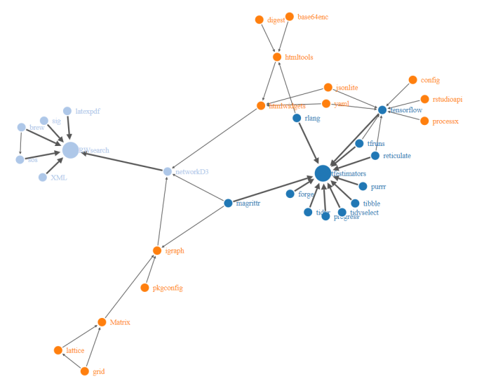

## Introduction

**RWsearch** stands for « Search in R packages, task views, CRAN and in the Web ». 

This vignette introduces the following features cited in the README file:

.7. **Plot the graph of the package dependencies** in an html page in your browser.

.8. List the **parent and children dependencies** of one or several packages, either the first level or the full list (termed *recursive*). 

.9. Use this information to reinstall or **install packages and their dependencies in the right order**, from the lowest number to the largest number of dependencies, and avoid mic-mac (very useful).


## Package dependencies

Let's assume we wish to update or install the packages **RWsearch**, **tfestimators** and their respective dependencies depicted in the image below. In which order should we install them ? 

A simple strategy is to apply **install.packages(c("RWsearch", "tfestimators"))** and let the function manage the dependency order. A better strategy is to list all packages from the ones with no parent to the ones with many parents, then install these packages according to the list order. (Parallel) Installation is much faster and more secure as there is no recursive call and no branching. The list and the package order is provided with no pain by the instruction **p_vers_deps()**. 


```r
crandb_load(system.file("data", "zcrandb.rda", package = "RWsearch")) 
# or
# crandb_down()
```

### p_graphF() generates the graph of the package dependencies

**p_graphF()** generates a graph of the package dependencies and send it to the browser. See the image.

```r
p_graphF(RWsearch, tfestimators)
```

{ width=67% }


### p_vers_deps() lists the package dependencies in a proper order

```r
dfr <- p_vers_deps(tfestimators, RWsearch) ; dfr

#              nsloaded  version   crandb compare tdeps ndeps
# forge           FALSE     <NA>     <NA>       3     0     0
# tfruns          FALSE     <NA>     <NA>       3     0     0
# reticulate      FALSE     1.20     <NA>       2     0     0
# config          FALSE    0.3.1     <NA>       2     0     0
# yaml            FALSE    2.2.1     <NA>       2     0     0
# pkgconfig        TRUE    2.0.3     <NA>       2     0     0
# digest           TRUE   0.6.25     <NA>       2     0     0
# base64enc       FALSE    0.1-3     <NA>       2     0     0
# progress        FALSE    1.2.2     <NA>       2     0     0
# tidyselect      FALSE    1.1.1     <NA>       2     0     0
# purrr           FALSE    0.3.4     <NA>       2     0     0
# tibble          FALSE    3.1.2     <NA>       2     0     0
# tidyr           FALSE    1.1.3     <NA>       2     0     0
# processx        FALSE    3.4.2     <NA>       2     0     0
# rstudioapi      FALSE     0.13     <NA>       2     0     0
# rlang            TRUE   0.4.10   0.4.11      -1     0     0
# brew             TRUE    1.0-6    1.0-6       0     0     0
# latexpdf         TRUE    0.1.6    0.1.6       0     0     0
# sig              TRUE    0.0-5    0.0-5       0     0     0
# magrittr         TRUE    2.0.1    2.0.1       0     0     0
# jsonlite        FALSE    1.7.1    1.7.2      -1     1     0
# XML              TRUE 3.99-0.3 3.99-0.6      -1     2     0
# sos              TRUE    2.0-2    2.0-2       0     1     1
# igraph           TRUE    1.2.5    1.2.6      -1    10     2
# htmltools        TRUE    0.4.0  0.5.1.1      -1     5     3
# htmlwidgets      TRUE    1.5.1    1.5.3      -1     9     6
# tensorflow      FALSE     <NA>    2.4.0      -2     9     7
# networkD3        TRUE      0.4      0.4       0    18    10
# tfestimators    FALSE     <NA>    1.9.1      -2    18    16
# RWsearch         TRUE    4.9.1    4.8.0       1    24    16 
```

The colnames are the following:

- **nsloaded**: is the package loaded in the namespace or not? Here, RWsearch and its dependencies are looded and locked. A (ns)loaded package cannot be updated on the spot (especially if it has a dll/shared library, or S4 classes) but requires a fresh version of R with no external package loaded. Use preferably **install.packages()** or in some extreme cases **R CMD INSTALL**.
- **version** is the current version installed in your computer or _NA_ if the package is not installed. 
- **crandb** is the tar.gz version recorded in the crandb data.frame (here, a minimalist crandb with 110 packages was saved on 2021-06-02) and in your CRAN repository.
- **compare** compares the two version numbers: 
    - -2 is for a package not installed on the computer but available on CRAN.
    - -1 is for a package installed on the computer but with an older version than the one on CRAN.
    - 0 are for installed packages up to date.
    - +1 is for a fresh package that is more recent than the one on CRAN, typically the packages under development or downloaded from another repository.
    - +2 is for a package installed on the computer but not available on CRAN. It can be either a package that comes from another repository (github, gitlab, Bioconductor, R-forge, etc) or a pckage that has been removed from CRAN and archived.
    - +3 is for a package that is not installed on the computer and not available. It can ba for a instance a package available on another repository (github, gitlab, Bioconductor, R-forge, etc).
- **tdeps** is the total number of recursive parent dependencies, including the generic packages (stats, utils, tools, parallel, etc).
- **ndeps** is the total number of recursive parent dependencies excluding the generic packages, since they are provided with every R version and are not stored on CRAN. 


Note: In this current version of **RWsearch**, the comparison is done with the tar.gz version stored on the repository (CRAN, miniCRAN, local, etc), not with the binary versions (macOS, Windows) that are published a few days later. The installation of mixed source/binary version is therefore recommended for Windows and mcOS users (but requires **Rtools** to be installed).


Packages with comparison number **-2** and **-1** can be installed according to the list order, which is from low values to high values of **ndeps**.


### Subset the data.frame of the package dependencies

Packages that can be installed on the spot are:

```r
dfr1 <- subset(dfr, compare < 0 & nsloaded == FALSE) ; dfr1

#              nsloaded  version   crandb compare tdeps ndeps
# jsonlite        FALSE    1.7.1    1.7.2      -1     1     0
# tensorflow      FALSE     <NA>    2.4.0      -2     9     7
# tfestimators    FALSE     <NA>    1.9.1      -2    18    16
```


Packages to be installed later are:

```r
subset(dfr, compare < 0 & nsloaded == TRUE)

#              nsloaded  version   crandb compare tdeps ndeps
# rlang            TRUE   0.4.10   0.4.11      -1     0     0
# XML              TRUE 3.99-0.3 3.99-0.6      -1     2     0
# igraph           TRUE    1.2.5    1.2.6      -1    10     2
# htmltools        TRUE    0.4.0  0.5.1.1      -1     5     3
# htmlwidgets      TRUE    1.5.1    1.5.3      -1     9     6
```


### p_inst() installs the packages

**p_inst()** is a simple wrapper around **install.packages()** with non-standard evaluation permitted. For all non-standard cases, use more sophisticated functions like **install.packages()** or **remotes::remotes()**.

```r
p_inst(rownames(dfr1))
```


