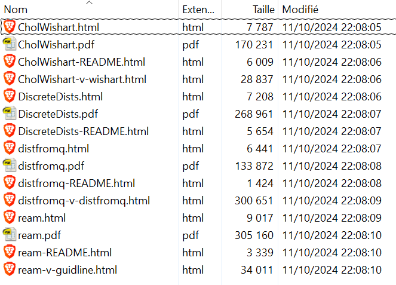

## Introduction

**RWsearch** stands for « Search in R packages, task views, CRAN and in the Web ». 

This vignette introduces the following features cited in the README file:

.12. Provide some **tools for task view maintenance**: Detect the packages recently added to or updated in CRAN, check if they match some keywords, check if they are already recorded in a given task view.

.5. **Display the results as a list or as a table** in the console or in the browser and save them as txt, md, html, tex or pdf files.


## Task views

Task views are an important part of CRAN as they help R users to find the packages that match their needs. [Task view pages](https://cran.r-project.org/web/views/) are maintained by volunteers who update the pages and upload them to CRAN with the package [ctv](https://CRAN.R-project.org/package=ctv).

**RWsearch** focuses on detecting the (old and new) packages that could be added to the task views.


## View, download, load and explore task views

As a preliminary, all task views can be read on-line with the instruction:

```r
h_crantv()
# Open the html page of CRAN task views in the browser
```

**RWsearch** provides the functions **`tvdb_down()`** and **`tvdb_load()`** to download a file renamed or load the task views in *.GlobalEnv* as a list named **_tvdb_**. Four functions are available to explore this list: **`tv_vec()`**, **`tvdb_dfr()`**, **`tvdb_list()`**, **`tvdb_pkgs()`**. 


### crandb_down(), tvdb_down(), crandb_load(), tvdb_load()

In an empty directory, the two files _crandb.rda_ and _tvdb.rda_, which are cleaned versions of the files  */web/packages/packages.rds* and */src/contrib/Views.rds*, must be downloaded from CRAN. Once downloaded, the files are automatically loaded with names **_crandb_** (a data.frame) and **_tvdb_** (a list) in *.GlobalEnv*. The most recently updated task view can have an older date than the saved date. 

```r
crandb_down()
# $newfile
# [1] "crandb.rda saved and loaded. 17672 packages listed between 2006-03-15 and 2021-06-02"

tvdb_down()
# [1] "tvdb.rda saved. tvdb loaded. 41 task views listed between 2015-01-07 and 2021-06-02"

ls()
# [1] "crandb" "tvdb"  
```
     
If the files already exist in one specific directory, they can be loaded. Here are the numbers for February 2019, June 2021 and September 2024:

```r
crandb_load(filename = "crandb-2024-0926.rda") 
# "crandb loaded. 13752 packages listed between 2006-03-15 and 2019-02-25"
# "crandb loaded. 17672 packages listed between 2006-03-15 and 2021-06-02"
# "crandb loaded. 21403 packages listed between 2008-09-08 and 2024-09-26"

tvdb_load(filename = "tvdb-2024-0926.rda") 
# tvdb loaded. 39 task views listed between 2015-01-07 and 2019-02-25
# tvdb loaded. 41 task views listed between 2015-01-07 and 2021-06-02
# tvdb loaded. 45 task views listed between 2021-12-29 and 2024-09-25
```


### tvdb_vec(), tvdb_dfr()

Functions **`tv_vec()`** and **`tvdb_dfr()`** list the task views available and their topics.

There were 39 task views in February 2019, 41 task views in June 2021 and 45 task views in September 2024. The latest two task views are *TeachingStatistics* and *Tracking*. The largest task view is *Time Series* with 273 packages in February 2019, 326 in June 2021 and 402 packages in September 2024. Many task views are maintained a minima and list less packages than in February 2019 due to packages archived by CRAN. Task views need to be reconsidered.


```r
tvdb_vec() 

#  [1] "ActuarialScience"          "Agriculture"               "Bayesian"                 
#  [4] "CausalInference"           "ChemPhys"                  "ClinicalTrials"           
#  [7] "Cluster"                   "Databases"                 "DifferentialEquations"    
# [10] "Distributions"             "DynamicVisualizations"     "Econometrics"             
# [13] "Environmetrics"            "Epidemiology"              "ExperimentalDesign"       
# [16] "ExtremeValue"              "Finance"                   "FunctionalData"           
# [19] "GraphicalModels"           "HighPerformanceComputing"  "Hydrology"                
# [22] "MachineLearning"           "MedicalImaging"            "MetaAnalysis"             
# [25] "MissingData"               "MixedModels"               "ModelDeployment"          
# [28] "NaturalLanguageProcessing" "NumericalMathematics"      "OfficialStatistics"       
# [31] "Omics"                     "Optimization"              "Pharmacokinetics"         
# [34] "Phylogenetics"             "Psychometrics"             "ReproducibleResearch"     
# [37] "Robust"                    "Spatial"                   "SpatioTemporal"           
# [40] "SportsAnalytics"           "Survival"                  "TeachingStatistics"       
# [43] "TimeSeries"                "Tracking"                  "WebTechnologies"          
```


```r
tv2 <- tvdb_dfr()
tv2 <- tv2[order(tv2$npkgs),]
rownames(tv2) <- NULL
print(tv2, right=FALSE)

#    version    npkgs name                      topic (xx packages in June 2021)                                                               
# 1  2022-08-24  31   ModelDeployment           Model Deployment with R (32)                                            
# 2  2022-08-31  33   MedicalImaging            Medical Image Analysis (23)                                             
# 3  2023-05-25  34   DifferentialEquations     Differential Equations (28)                                             
# 4  2023-04-05  39   GraphicalModels           Graphical Models (40)                                                   
# 5  2024-06-06  41   ActuarialScience          Actuarial Science (new)                                                 
# 6  2023-11-04  41   ExtremeValue              Extreme Value Analysis (24)                                             
# 7  2024-08-22  43   Pharmacokinetics          Analysis of Pharmacokinetic Data (18)                                   
# 8  2023-02-23  45   Databases                 Databases with R (37)                                                   
# 9  2024-09-25  47   DynamicVisualizations     Dynamic Visualizations and Interactive Graphics (34)                    
# 10 2023-03-07  49   Tracking                  Processing and Analysis of Tracking Data (49)                           
# 11 2023-07-01  52   Robust                    Robust Statistical Methods (58)                                         
# 12 2024-08-01  53   TeachingStatistics        Teaching Statistics (45)                                                
# 13 2021-12-29  55   ClinicalTrials            Clinical Trial Design, Monitoring, and Analysis (61)                    
# 14 2024-06-17  57   FunctionalData            Functional Data Analysis (40)                                           
# 15 2023-09-12  60   NaturalLanguageProcessing Natural Language Processing (55)                                        
# 16 2022-10-01  72   SpatioTemporal            Handling and Analyzing Spatio-Temporal Data (92)                        
# 17 2024-09-19  79   SportsAnalytics           Sports Analytics (new)                                                   
# 18 2024-05-13  91   HighPerformanceComputing  High-Performance and Parallel Computing with R (92)                     
# 19 2024-09-12  93   Epidemiology              Epidemiology (new)                                                       
# 20 2024-01-29  98   ChemPhys                  Chemometrics and Computational Physics (81)                             
# 21 2023-12-18 100   Environmetrics            Analysis of Ecological and Environmental Data (94)                      
# 22 2023-04-05 102   ExperimentalDesign        Design of Experiments (DoE) & Analysis of Experimental Data  (112)       
# 23 2024-01-30 105   Phylogenetics             Phylogenetics (82)                                                      
# 24 2024-08-20 107   Cluster                   Cluster Analysis & Finite Mixture Models (106)                           
# 25 2023-07-20 113   MachineLearning           Machine Learning & Statistical Learning (96)                            
# 26 2024-09-25 114   ReproducibleResearch      Reproducible Research (92)                                              
# 27 2024-07-27 126   NumericalMathematics      Numerical Mathematics (115)                                              
# 28 2024-03-08 127   Hydrology                 Hydrological Data and Modeling (98)                                     
# 29 2024-07-05 137   Optimization              Optimization and Mathematical Programming (136)                          
# 30 2024-04-09 140   OfficialStatistics        Official Statistics & Survey Statistics (132)                            
# 31 2023-08-04 152   CausalInference           Causal Inference (new)                                                   
# 32 2024-06-03 152   Econometrics              Econometrics (144)                                                       
# 33 2024-09-19 154   Finance                   Empirical Finance (156)                                                  
# 34 2024-09-12 168   Agriculture               Agricultural Science (new)                                               
# 35 2024-05-08 168   MixedModels               Mixed, Multilevel, and Hierarchical Models in R  (111)                   
# 36 2024-09-10 184   MetaAnalysis              Meta-Analysis (154)                                                       
# 37 2023-02-18 188   WebTechnologies           Web Technologies and Services (204)                                      
# 38 2024-06-18 198   Spatial                   Analysis of Spatial Data (184)                                           
# 39 2023-07-17 200   Bayesian                  Bayesian Inference (138)                                                 
# 40 2023-09-10 223   Survival                  Survival Analysis (251)                                                  
# 41 2023-12-15 230   Psychometrics             Psychometric Models and Methods (242)                                     
# 42 2024-09-25 254   Omics                     Genomics, Proteomics, Metabolomics, Transcriptomics, and Other Omics (new)
# 43 2024-06-20 269   MissingData               Missing Data (164)                                                      
# 44 2024-09-25 318   Distributions             Probability Distributions (252)                                          
# 45 2024-09-09 402   TimeSeries                Time Series Analysis (326)                                                                                    
```


### tvdb_list(), tvdb_pkgs()

**`tv_list()`** lists all task views and their packages. 
**`tvdb_dfr()`** lists the packages of the task views selected by the user. 

```r
tvdb_list()

$ActuarialScience
#  [1] "actuar"                 "actuaRE"                "ActuarialM"            
# ...
# [40] "tweedie"                "WH"    
# ...
# ...
# $WebTechnologies
# [1] "ajv"                   "analogsea"             "arrow"                 "aRxiv"                 
# ...
# [185] "xslt"                  "yaml"                  "yhatr"                 "zen4R"  
```


```r
tvdb_pkgs(ChemPhys, Distributions, Robust)

# $ChemPhys
#  [1] "AeroSampleR"  "albatross"     "ALS"       "AquaEnv"   "astrodatR" 
# ...
# [96] "units"        "varSelRF"      "webchem"
#
# $Distributions
#   [1] "actuar"    "AdMit"    "AEP"    "agricolae"    "ald"    "alphastable" 
# ...
# [317] "zipfextR"  "zipfR"
#
# $Robust
#  [1] "clubSandwich" "cluster"      "clusterSEs"   "complmrob"    "covRobust"
# ...
# [51] "walrus"       "WRS2"
```


### Counting the number of referred packages

The largest task view has referred 326 packages (273 in February 2019). All task views have referred 4298 (4021) packages but only 3451 (3221) unique packages. This is 19.5 % (down from 23.4 % in 2019) of the total number of packages currently in CRAN. The task is immense if we want to refer all packages. 


```r
nrow(crandb)
# 21403  (17672 in June 2021, 13752 in February 2019)

max(sapply(tvdb_list(), length))
# [1] 402  (326 in June 2021, 273 in February 2019)

length(unlist(tvdb_list()))
# [1] 5544 (4298 in June 2021, 4021 in February 2019)

length(unique(unlist(tvdb_list())))
# [1] 4646 (3451 in June 2021, 3221 in February 2019)
```


## Task view maintenance

**RWsearch** focuses on detecting the (old and new) packages that could be added to the task views.

Function **`s_crandb_tvdb()`** combines many functions of **RWsearch**. It searchs packages in **crandb** by keywords and checks if the found packages are referred in the selected task view and installed in the computer (in the */site-library* directory).

The example presented below refers to the [Distributions](https://CRAN.R-project.org/view=Distributions) task view.


### s_crandb_tvdb()

The output of **`s_crandb_tvdb()`** is a list with the following items:

- **spkgs**:   packages that match the keywords.
- **inTV**:    packages that are already referred in the selected task view.
- **notinTV**: packages that are not (yet) referred in the task view.
- **inTV_in**: packages that are referred and installed in the computer.
- **inTV_un**: packages that are referred but not installed in the computer.
- **notinTV_in**: packages that are not referred and installed in the computer.
- **notinTV_un**: packages that are neither referred nor installed in the computer.


```r
keywords <- cnsc(probability, distribution)
(lst <- s_crandb_tvdb(char = keywords, tv = "Distributions", 
                      from = -15, to = "2024-09-26", select = "PT"))

# $spkgs
#  [1] "bayesSurv"        "changepointTests" "CholWishart"      "degreenet"       
#  [5] "DiscreteDists"    "distfromq"        "distributional"   "distributions3"  
#  [9] "e1071"            "eSDM"             "evd"              "mniw"            
# [13] "modelbpp"         "mvgb"             "MVT"              "PhaseType"       
# [17] "PoissonBinomial"  "ream"             "scoringRules"     "TLIC"            

# $inTV
# [1] "degreenet"       "distributional"  "distributions3"  "e1071"           "evd"            
# [6] "mniw"            "mvgb"            "MVT"             "PoissonBinomial"

# $notinTV
#  [1] "bayesSurv"        "changepointTests" "CholWishart"      "DiscreteDists"   
#  [5] "distfromq"        "eSDM"             "modelbpp"         "PhaseType"       
#  [9] "ream"             "scoringRules"     "TLIC"            

# $inTV_in
# [1] "distributional" "e1071"          "evd"           

# $inTV_un
# [1] "degreenet"       "distributions3"  "mniw"            "mvgb"            "MVT"            
# [6] "PoissonBinomial"

# $notinTV_in
# character(0)

# $notinTV_un
#  [1] "bayesSurv"        "changepointTests" "CholWishart"      "DiscreteDists"   
#  [5] "distfromq"        "eSDM"             "modelbpp"         "PhaseType"       
#  [9] "ream"             "scoringRules"     "TLIC"            

```


## Visualize the unreferred packages

A first assesment of the packages that match the keywords can be done with **`p_table2()`**. Consider also **`p_display5()`** to read the results in the browser. 


### p_table2(), p_display5()

```r
p_table2(lst$notinTV)

#       Package          Title                                                                            
# 1153  bayesSurv        Bayesian Survival Regression with Flexible Error and Random Effects Distributions
# 2378  changepointTests Change Point Tests for Joint Distributions and Copulas                           
# 2455  CholWishart      Cholesky Decomposition of the Wishart Distribution                               
# 4324  DiscreteDists    Discrete Statistical Distributions                                               
# 4366  distfromq        Reconstruct a Distribution from a Collection of Quantiles                        
# 5386  eSDM             Ensemble Tool for Predictions from Species Distribution Models                   
# 11363 modelbpp         Model BIC Posterior Probability                                                  
# 13551 PhaseType        Inference for Phase-Type Distributions                                           
# 15449 ream             Density, Distribution, and Sampling Functions for Evidence Accumulation Models   
# 17177 scoringRules     Scoring Rules for Parametric and Simulated Distribution Forecasts                
# 19865 TLIC             The LIC for T Distribution Regression Analysis                                   
                                                     
```

```r
p_display5(lst$notinTV)
## read the html page launched in your browser
```

From the package titla above and the DESCRIPTION in the html page, packages **CholWishart**, **DiscreteDists**, **distfromq** and **ream** deserve further exploration. 


### p_page(), p_pdfweb()

4 packages is a reasonnable number. We can open the _CRAN/index.html_ pages and _CRAN/manual.pdf_ files in the browser. Alternatively, consider downloading the documentation of these packages.

```r
pkgs <- cnsc(CholWishart, DiscreteDists, distfromq, ream)

p_page(pkgs)
## read the 4 html pages launched in your browser

p_pdfweb(pkgs)
## read the 4 pdf pages launched in your browser

p_down(pkgs)
## read the files saved in the current directory
```


{ width=60% }


The pdf files and the vignettes give all expected information and help decide whether or not include the package in the task view


